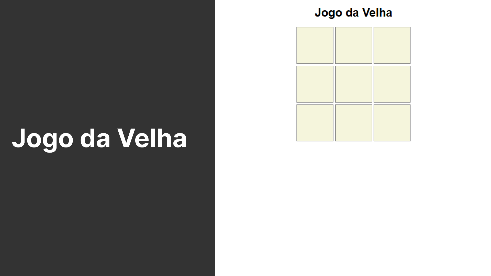

# 🎮 Jogo da Velha

Criei um **Jogo da Velha** totalmente funcional usando **HTML, CSS e JavaScript**, como um projeto para treinar lógica, manipulação do DOM e interfaces interativas.  

O jogo é simples e divertido:  
- Dois jogadores alternam turnos com **O** e **X**.  
- O jogo identifica automaticamente quando alguém vence.  
- Após o alerta do vencedor, o jogo **reinicia automaticamente**, permitindo partidas contínuas.  

---

## 💻 Tecnologias utilizadas
- **HTML**: estrutura do tabuleiro  
- **CSS**: estilização dos quadrados e símbolos  
- **JavaScript**: lógica do jogo, detecção de vitória e reinício automático  

---

## 🔧 Funcionalidades
- Alternância automática de jogadores  
- Verificação de todas as combinações de vitória  
- Atualização dinâmica do tabuleiro  
- Reinício do jogo após o alerta  

---

## 🚀 Acesse o projeto
👉 [Jogar no GitHub Pages](https://thamiressarges.github.io/jogo-da-velha)

---
